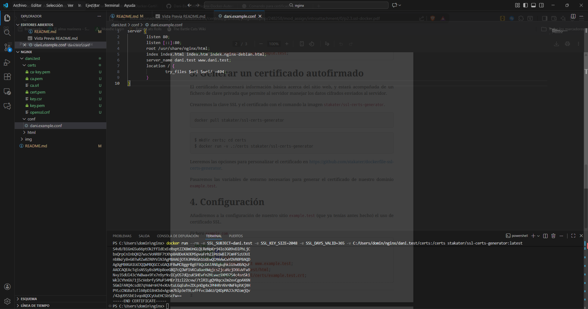
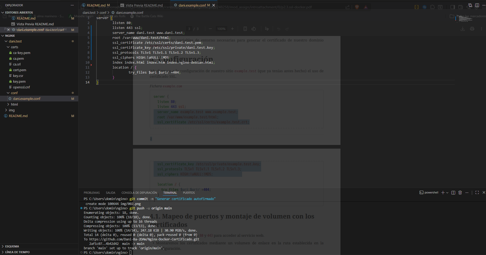
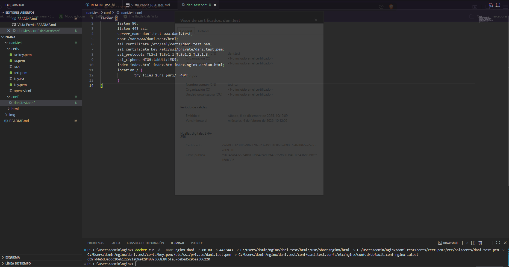
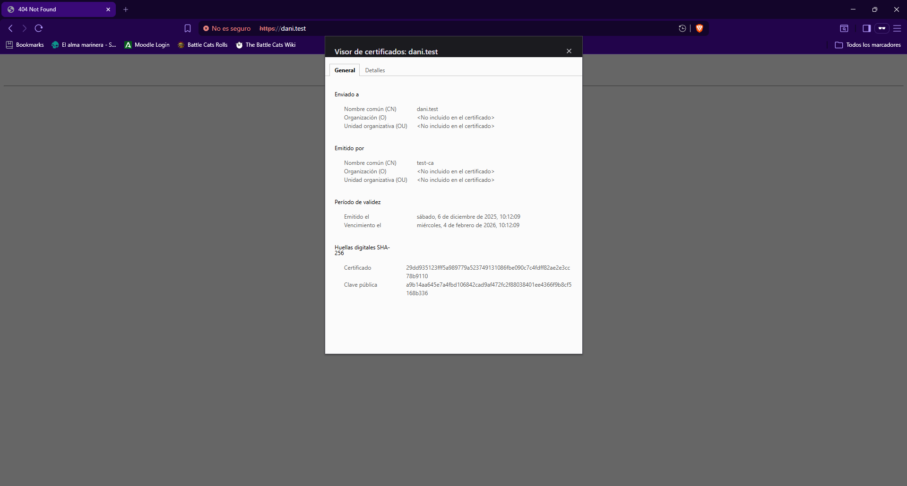

# Acceso seguro en Nginx con Docker

## Configuración básica de Nginx

## Generar certificado autofirmado

### Instalación de paquetes necesarios
Realizado en la [práctica anterior](https://github.com/Dani-Ba-2DAW/Nginx-Docker-Autenticacion#instalaci%C3%B3n-de-paquetes-necesarios).

### Generar certificado
¡Recuerda cambiar "~" por "C:/Users/[usuario]" si estás en Windows!  
¡Importante, no se genera un .crt, se va a usar el .pem que genera!  
Comando: docker run --rm -e SSL_SUBJECT=dani.test -e SSL_KEY_SIZE=2048 -e SSL_DAYS_VALID=365 -v ~/certs:/certs stakater/ssl-certs-generator:latest

## Configuración con certificado

### Lanzamiento y comprobación de funcionamiento
Comando: docker run -d --name nginx-dani -p 80:80 -p 443:443 -v ~/html:/usr/share/nginx/html -v ~/certs/cert.pem:/etc/ssl/certs/dani.test.pem -v ~/certs/key.pem:/etc/ssl/private/dani.test.pem -v ~/conf/dani.test.conf:/etc/nginx/conf.d/default.conf nginx:latest

#### Lanzamiento del comando

#### Comprobación del certificado
